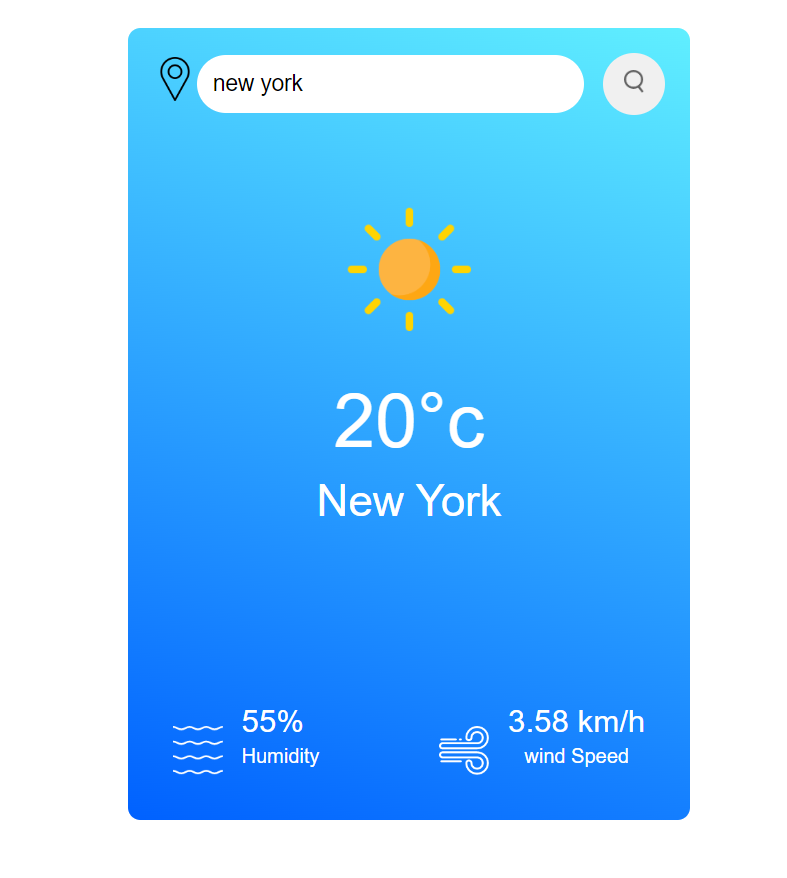

# Cloud-Point Weather App

## Overview

Cloud-Point is a weather app built using JavaScript that provides real-time weather information. It's a simple and intuitive tool to check the weather conditions.

## Features

- Real-time weather updates
- User-friendly interface
- Displays current temperature, humidity, and wind speed
- Responsive design for various devices

## Technologies Used

- JavaScript
- JS APIs

## Usage

- Enter the city name or location to get the current weather information.

## Screenshots

